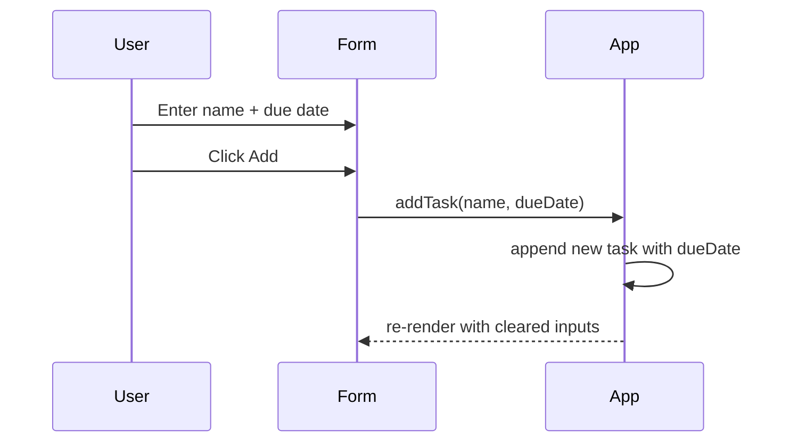

# PRD-001/002/003 Architecture - UI Styling, Banner, Due Dates

## Feature summary
- Add a small banner region that always shows the app title, a short subtitle, and one compact info item.
- Improve button styling to clearly separate primary, destructive, and filter-selected states, including hover states.
- Extend tasks with an optional due date and make it editable and displayable across add/edit/view flows.
- Target a demo-friendly UI with minimal new dependencies and minimal changes to existing component structure.

## UI/UX behavior
- Banner is visible above the main app content on all screen sizes; it includes the app title, subtitle, and a single info item.
- Info item choice: task count (total tasks) so the banner is stable across filters; it updates reactively.
- Add task form includes a date input labeled "Due date (optional)"; leaving it empty produces no due date.
- Task list items display a due date line only when a date exists (example: "Due: 2026-02-04").
- Edit task mode adds a date input for due date; it preserves the existing date when entering edit mode.
- Button styles: "Add" and "Save" share a primary style; "Delete" remains destructive; filter buttons have a clear selected state and hover feedback.
- Empty states: No extra placeholder is shown for missing due dates; other existing empty behaviors remain unchanged.
- Error states: No new error UI is introduced; optional due date input is not required.

## Data model
Task shape (new field is optional):
- `id`: string
- `name`: string
- `completed`: boolean
- `dueDate`: string | null (ISO date string, `YYYY-MM-DD`)

Examples:
- `{ id: "todo-1", name: "Read docs", completed: false, dueDate: "2026-02-04" }`
- `{ id: "todo-2", name: "Email TA", completed: true, dueDate: null }`

## Component impact map
- [src/App.jsx](src/App.jsx): extend task shape, pass due date props, compute banner info item, update `addTask`/`editTask` signatures.
- [src/components/Form.jsx](src/components/Form.jsx): add optional date input and pass due date to `addTask`.
- [src/components/Todo.jsx](src/components/Todo.jsx): display due date in view mode; include due date input in edit mode; include due date in `editTask` call.
- [src/components/FilterButton.jsx](src/components/FilterButton.jsx): no logic change; styling updated via CSS for selected and hover states.
- [src/main.jsx](src/main.jsx): no change expected.
- [src/index.css](src/index.css): new banner styles; update button styles, hover states, and filter selected state.
- New component (recommended): `src/components/Banner.jsx` for the header UI region, keeping `App.jsx` clean.

## State & data flow
- State lives in `App.jsx`: `tasks`, `filter`.
- `Form` lifts new task data to `App` via `addTask(name, dueDate)`.
- `Todo` lifts edits to `App` via `editTask(id, name, dueDate)`.
- `Banner` receives computed display props from `App` (title, subtitle, task count).

Mermaid: component diagram
```mermaid
flowchart TB
  User((User)) --> App[App]
  App --> Banner[Banner]
  App --> Form[Form]
  App --> FilterButton[FilterButton]
  App --> Todo[Todo]
  Form -->|addTask(name, dueDate)| App
  Todo -->|editTask(id, name, dueDate)| App
  Todo -->|toggleTaskCompleted/deleteTask| App
```

Mermaid: sequence diagram (Add task with due date)


## NFR checklist
- Accessibility: label the date input; keep keyboard focus order unchanged; avoid relying on color only for selected state.
- Performance: keep derived banner info simple (count from `tasks.length`); avoid expensive date parsing.
- Security/Privacy: due date is non-sensitive; do not inject HTML; no storage added.
- Maintainability: keep task shape stable; confine UI-only styles to `index.css` and banner styles to a single block.

## Implementation steps
1. Add a `Banner` component that accepts `title`, `subtitle`, and `info` props and renders the new top region.
2. Update `App.jsx` to render the banner above the form and compute the info item (task count).
3. Extend the task model in `App.jsx` and update `addTask` to accept optional `dueDate`.
4. Update `Form.jsx` to include a date input and pass `dueDate` to `addTask`.
5. Update `Todo.jsx` to display due date in view mode and include a date input in edit mode; update `editTask` signature and calls.
6. Update `App.jsx` `editTask` implementation to persist due dates.
7. Adjust `index.css` to style the banner and improve button styles, hover states, and filter selected states.
8. Manually verify: add/edit/delete with due dates, filter toggles, banner updates, and hover states.

## Phased approach
- Phase 1 (MVP): banner + due date fields + basic button style updates for primary/destructive/selected.
- Phase 2 (Polish): refined spacing and hover transitions; optional badge-style info item in banner.
